# Project 1: Peace Master Website

## Who is this website for?
This website is for people who are curious but intimidated by meditation, yoga, mindfulness and its many different definitions/perspectives based on culture and history. Its purpose is to convince people that meditation, yoga and mindfulness is for everybody and not just for a particular group of people that think in an identical way. Users will learn about the differences between meditation practices, their origins and techniques that are simplified so that children are even capable of trying them.

## Responsive Test
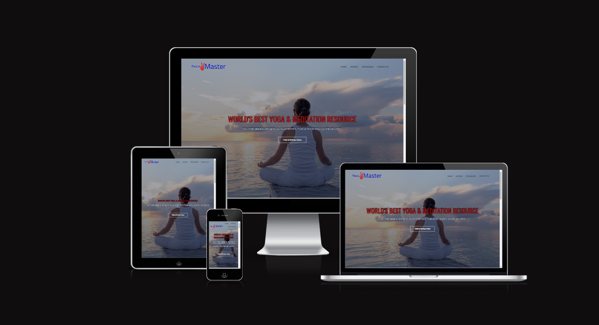

## Features Section
### Navigation

The navigation bar is tucked away into the top left of the screen, being clear and to the point with their intention. The 'Contact Us' navigation link directs you to the bottom of the index.html page but the others direct you to their own unique web pages.
### Header
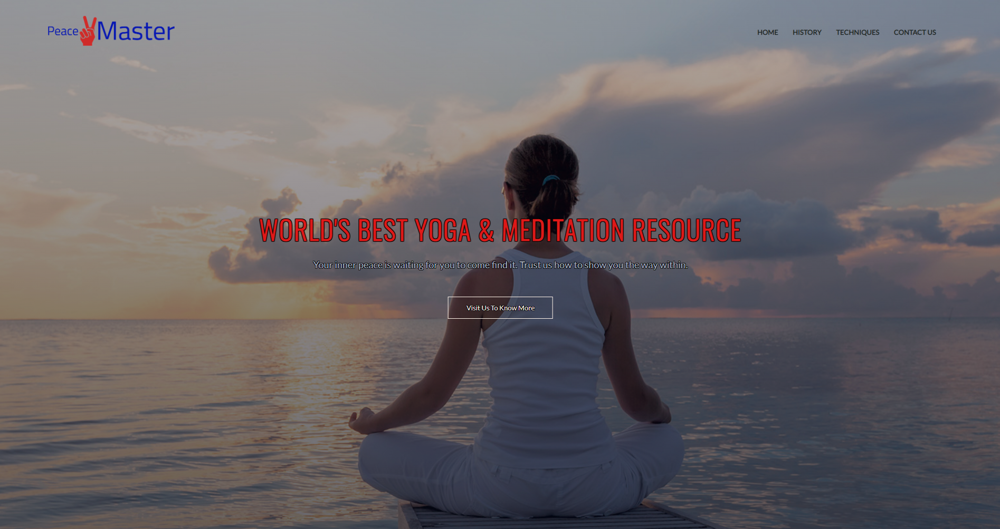
I liked the idea of having a background image fill the whole homepage. There is a button in the middle of this header section to redirect you to just underneath the picture just in case somebody doesn't instinctivly scroll downward. The text contrasts well with the background image and is accessible. The text shadow around the font helps emphasise this.

### Goals
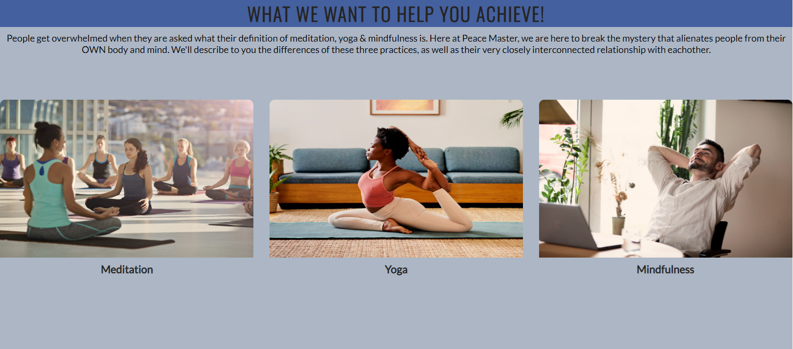
Here I wanted to put a brief summary of the purpose of this website. I wanted people to see exactly how meditation practices are split into 3 main categories and that I will be breaking down and explaining to the user exactly what the differences are and how I can clear up confusion about abstract nature of their definitions.

### Courses Section
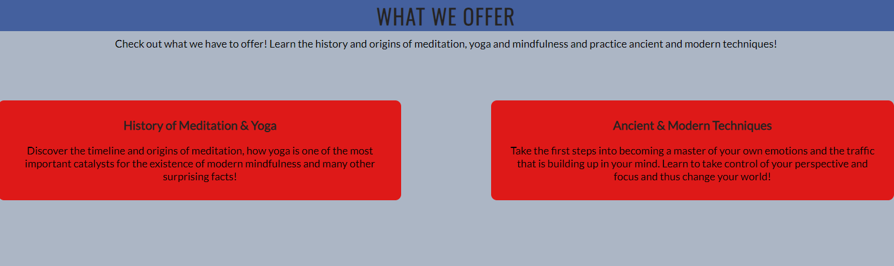
I wanted another way for people to click on the 'history' and 'techniques' section of the website. I thought this would give people an incentive to get right into the website rather than potentially losing interest and clicking off. These sections highlight up, so that a user may be made aware that they are clickable and that they will redirect you to where you want to be. 

### Testimonials Section
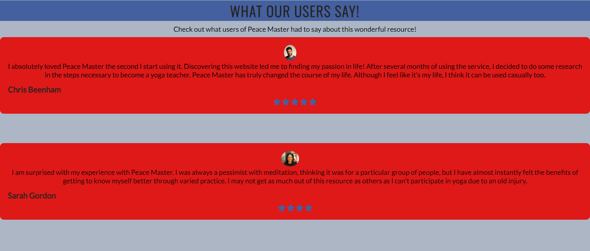
I thought that having a testimonial section at the end of the website would be smart, because if people weren't interested in the contents of the website by the end of the page, they might be given inspiration by existing users' experiences. 

### Footer Section

It was important for me to include social media links at the end of the page. This would incentivise users to connect with the platform and potentially network it to their friends on their own social media pages. I used icons to make them instantly readable and their intention obvious. 

### Sign-Up-Button Section

I included a sign in form so that people could feel like they are a part of the community Peace Master. This would also keep the user engaged. 

### Sign-up Page
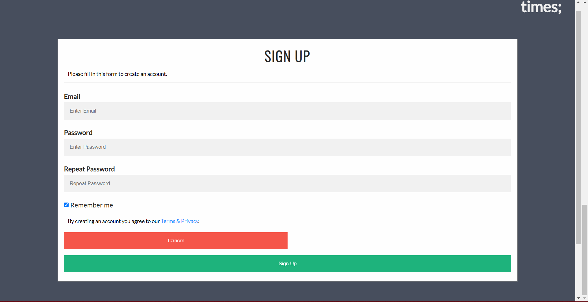
This is where the user is redirected to when they click the sign up button. The form is working and collects the users inputs.

### History Section
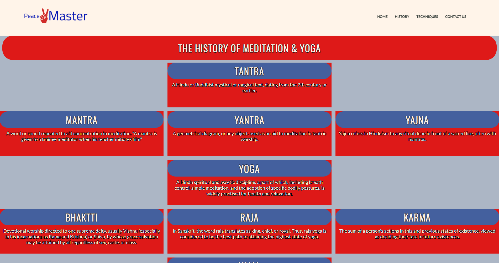
This section's intention is to show the user the map of meditation, yoga and mindfulness. Most people don't know that mindfulness is a very new meditative technique and I wanted to show them the progress that it took to get there through culture and society. The grid structure of the page allowed me to have relevant categories placed beside each other, and the middle section being the main route of the history map.

### Video Player Section
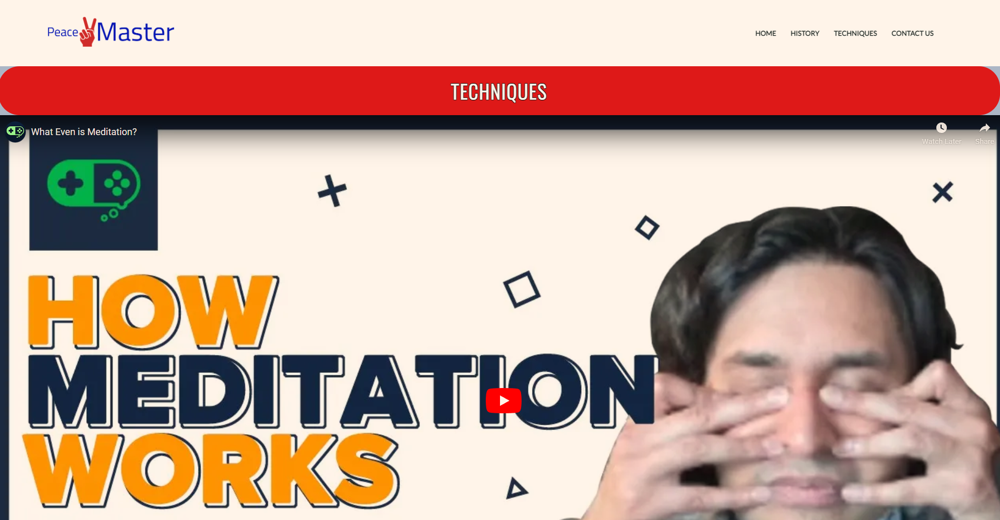
This video explains in detail exactly what meditation is. It is a complete overview of the basics and origins of the practice. I thought having this directly at the top of the techniques section would push the user to watch it first before exploring the content.

### Techniques Section 
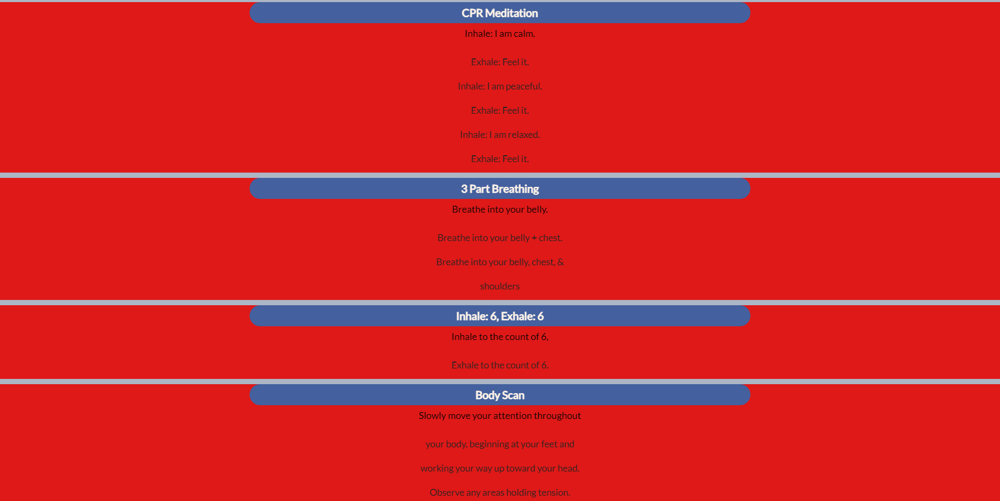
This is the section of the website that actually trains you to practice meditative techniques through simple to understand directions. I used a grid again so that the page could be an easy reference for on-the-go meditation. 

## Testing Section
- Confirmed each link directs to the correct place
- Tested multiple examples of responsiveness on the website using Chrome Dev Tools
- Made sure the navigation links were in order of how I would like users to navigate the website as a whole - even when made responsive to different devices. 
- Used website on different devices 

## Solved Bugs Sections
- There was a bug in my 'history section' of the website that would refuse to show the full width of the content when on some models of Apple iPhone. I tried many different methods of media query and eventually came to the conclusion that each grid would be put one under the other instead of a row of 3 grid sections.
- The color contrast of my page was poor. I used a website called 'coolors' that allowed me to find a color palette that meshed together well and was more accessible.
- There was a bug in my techniques page that forced me to change the height of the page in too many different types of widths. I eventually found that the variable height: fit-content; vairable worked very well and I went back and used this on numerous different places of my website.
- The video iframe on the techniques page failed to scale with the responsiveness of the site. I had to apply a manual mathmatical scaling formula in my CSS to make it work and be fully displayed to scale no matter what the page size was without sacrificing the rest of the elements on the page.

## HTML/CSS Validator Test
w3c html validator - No errors were returned when passing through the official W3C validator 
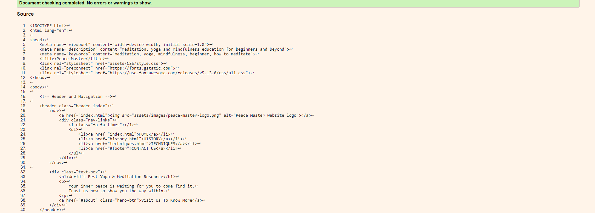
w3c css validator - No errors were returned when passing through the official (Jigsaw) validator
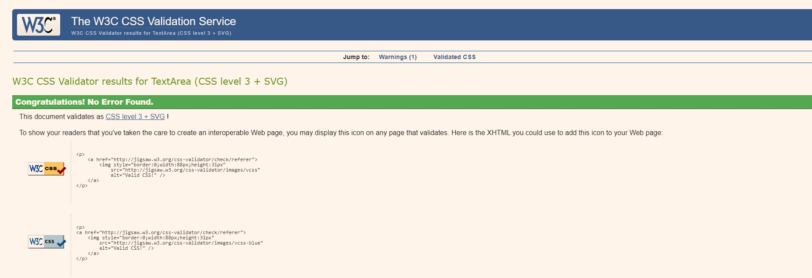

## Site Accessibility
I tested my site's accessibility by inspecting it with Lighthouse and getting a very positive score. This was due to my placement of alt tags for images, making foregrounds seem like they are in front of backgrounds and was very careful with the use of color in text and images. 
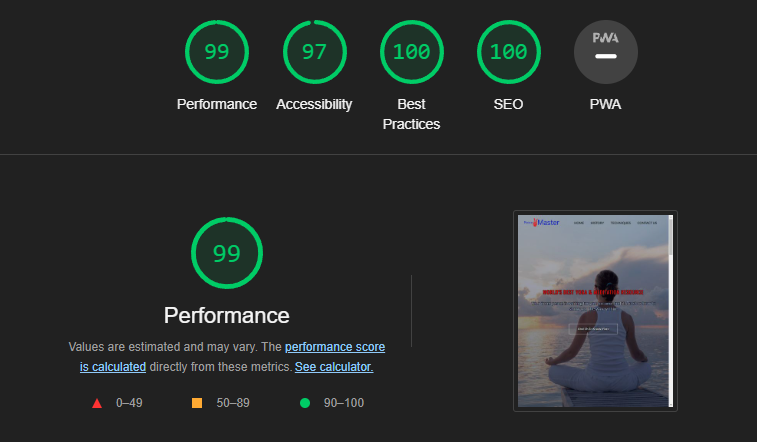

## Deployment Section
The site was deployed by GitHub Pages. the steps to deploy are as follows:
- In the Github repository, navigate to the settings tab
From the source section drop-down menu, select The Master Branch
- Once the master branch has been selected, the page provided the link to the completed website.
- The live link can be found here at [Peace Master](https://jordankingveoxyl.github.io/Peace-Master/)

## Credits Section
### Content
- The code to make part of the navigation, social media links and decorate CSS was taken from the CI Love Running Project 
- Sign Up Form taken from w3sschools: https://www.w3schools.com/howto/howto_css_signup_form.asp
- Inspiration for the header image and its nature to other elements from a Easy Tutorials on YouTube https://www.youtube.com/watch?v=oYRda7UtuhA

Media Section
- All of the images I used were taken from [Pexels](https://www.pexels.com/)
- Youtube videos used in techniques section: ['What Even is Meditation?' by HealthyGamerGG](https://www.youtube.com/watch?v=dvq48pfJa9w)